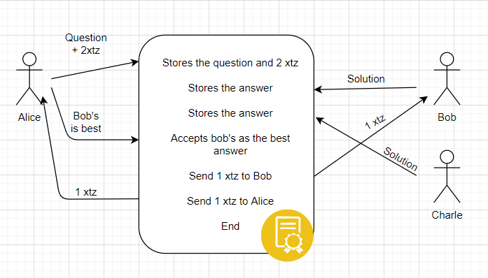

# Help-Me-Plz

## Project idea

This project is an online platform built on the tezos blockchain. The primary motive of the forum is to let users ask questions, and whoever answers it gets a reward from the person who asked.

Its looks just like any other asking platform, but it's not because:
- Here, you get rewarded for answering
- As you are rewarding someone for the answer, the answer will be valid, and you will get it faster. The higher the reward, the faster you get it answered.
- As there will always be some gas fees for asking or answering the question, people will not do silly things like copying other answers or asking 'duplicate' questions without proper research.

A smart contract will handle all the things for a single question. It will receive the query and twice the value of the reward(why twice explained later). Then it starts accepting answers. When the asker marks the best solution, the reward amount is transferred to the user who gave the best solution. Also, the remaining amount is sent back to the asker marking the end of all processes for this question.

Let say Alice asked a question, and the reward is 1 xtz. Now the rest is explained in diagram.

**Why twice the reward?**

The asker may not mark any solution as the best solution due to laziness or forgets about it after getting the answer. To make sure this doesn't occur, the smart contract keeps twice the amount of reward. 
